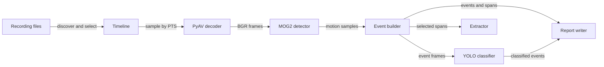

# Architecture

CamReview is a synchronous, stateless batch pipeline. It reads recordings and optional
configuration, streams sampled frames through motion and classification components, and
writes reports or extracted files. No server, database, queue, or persistent job state is
involved.

## Overview

The pipeline keeps footage local and passes bounded streams or domain records between stages:



The filename timestamp is the recording's authoritative local start. Frame presentation
timestamps become offsets from that start. This avoids dependence on filesystem metadata
and preserves nonuniform frame timing without introducing timezone conversion.

## Components

### Discovery and timeline

`filenames.py` recognizes supported extensions and parses the camera, date, and time from
the right side of each filename. `timeline.py` discovers files, selects exactly one
camera-day, detects gaps using probed durations or inferred cadence, clips requested ranges,
and maps an event window back to recording-relative source segments.

Discovery is top-level by default. Paths are expanded and resolved before enumeration so
mapped-drive and UNC semantics do not leak into PyAV or FFmpeg. Unrecognized, unsettled, and
inaccessible files remain explicit processing issues instead of silently disappearing.

### Decode and motion layers

`decoding/base.py` defines the decoder boundary. `PyAVDecoder` probes video metadata and
streams frames at requested sample times using PTS. It retries transient network failures,
resumes beyond the last emitted sample, falls back from broken seeks to sequential decode,
and can validate a hardware backend before committing to it.

`motion/base.py` defines the motion boundary. `MOG2MotionDetector` downsizes without
upscaling, converts to blurred grayscale, applies an optional binary mask, removes MOG2
shadow values, performs morphology, and measures foreground ratio and contours. Its
background model persists across continuous files and resets on resolution changes or large
timeline gaps. Scene-change frames are suppressed while the model adapts rapidly.

`EventBuilder` requires consecutive positive samples, closes after quiet time, merges nearby
events, and deliberately breaks continuity around failed or discontinuous footage. Source
segments are attached only after event construction.

### Classification

`detection/base.py` isolates object-detector implementations. `UltralyticsDetector` lazily
imports the optional stack, resolves model storage, selects CPU or CUDA, and converts YOLO
boxes into domain objects and broad categories.

Classification revisits only event source spans. Consecutive sampled frames produce a
dilated difference mask. A visible object contributes to an event category only if enough
of its box overlaps that mask; otherwise it remains in `visible_objects`. Batches are cleared
after inference, keeping memory bounded by `batch_size` plus decoder/model state.

### Reports and extraction

`models.py` contains the serializable domain records. `reports/io.py` treats JSON schema 1
as canonical and derives CSV and text views. Writes use a temporary sibling, flush, and
same-directory atomic replacement, including safe handling for shares that reject `fsync`.

`extraction/ffmpeg.py` has two paths. Source mode deduplicates and atomically copies original
files. Event mode maps pre/post-roll windows across recordings, then either re-encodes video
accurately or uses FFmpeg concat and stream copy for speed. Temporary work is bounded to one
event rather than a day-long intermediate.

## Data flow

A run resolves the source root, discovers candidate videos, and selects exactly one camera
and date. It probes durations before applying the requested time range. The decoder samples
frames in chronological order while the motion detector retains background state across
continuous files. The event builder closes, merges, and maps events to source-relative spans.

The report writer serializes every canonical event before filtered CSV, text, or extraction
views are created. When classification is enabled, the scan writes a motion checkpoint,
classifies only event spans, and then replaces the report with the complete result.

### Failure and recovery boundaries

In non-strict mode, a bad file breaks event continuity and becomes an issue and timeline gap;
the scan continues. In strict mode it aborts. A scan interrupted during processing writes an
`interrupted` JSON report. A scan requesting classification first writes a
`motion_complete_classification_pending` checkpoint so classification can be resumed with
the standalone command.

## Directory layout

```text
camreview/
├── cli.py              Argument parsing, dispatch, and exit-code mapping
├── commands/           Workflow orchestration
├── decoding/           Video decoder interface and PyAV implementation
├── motion/             Motion interface, MOG2, and event construction
├── detection/          Object detector interface, YOLO, and category logic
├── extraction/         Source copying and FFmpeg event extraction
├── reports/            Canonical serialization and human-facing projections
├── config.py           TOML merge and settings validation
├── filesystem.py       Retried network-safe filesystem operations
├── filenames.py        Recording naming contract
├── timeline.py         Discovery, selection, gaps, and source spans
└── models.py           Domain and report dataclasses
```

The command layer depends on interfaces and domain models; optional vendor integrations stay
behind detection and decoding boundaries. See the [Development guide](development.md) for how those
boundaries are tested.

## Design decisions

CamReview treats JSON as the durable handoff between machines and optional stages. It keeps
the scanner stateless instead of introducing a database. Filename timestamps win over file
metadata so copied recordings retain their camera timeline. Iterator-based decoding and
bounded detector batches avoid a day-sized frame cache, while destination-side temporary
files keep partial output from replacing the previous successful result.
